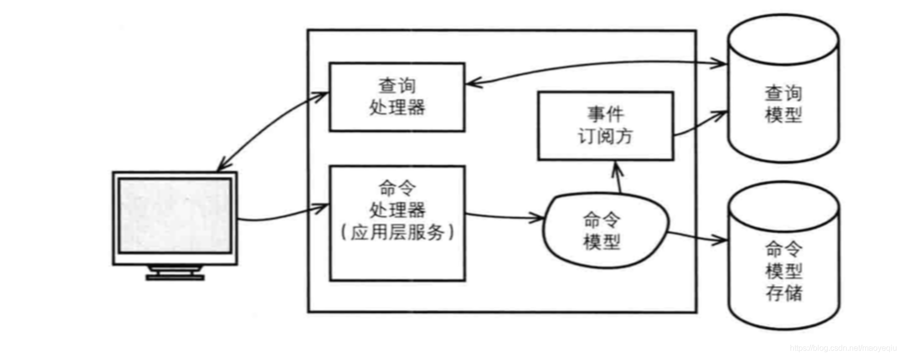

# CQRS

从资源库中查询所有需要显示的数据是困难的，特别是需要显示来自不同聚合类型与实例的数据时。领域越复杂，这种困难程度越大。 通过CQRS可以将这种复杂的领域数据映射到界面中。

CQRS[ Cammand-Query Responsibility Segregaion]的规则

如果一个方法修改了对象的状态，该方法便是一个命令(Command)，它不应该返回数据。
如果一个方法返回了数据，该方法便是一个查询，它不应该通过直接/间接的手段修改对象状态。
这样的话，领域模型将一分为二，由命令模型和查询模型分开进行存储。如下图：

数据库分为只读，和读写。并根据不同的需求划分方法的业务编写。大量查询可以用数据库连接池。
根据不同的业务情况去处理查询模型(读)和命令模型(写)