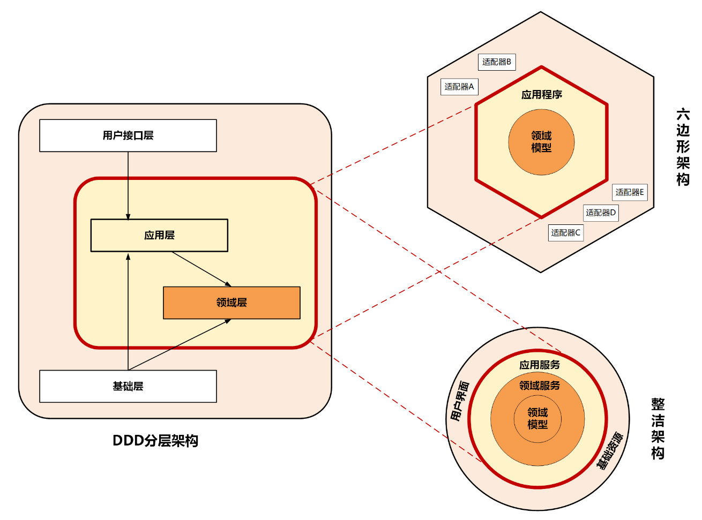
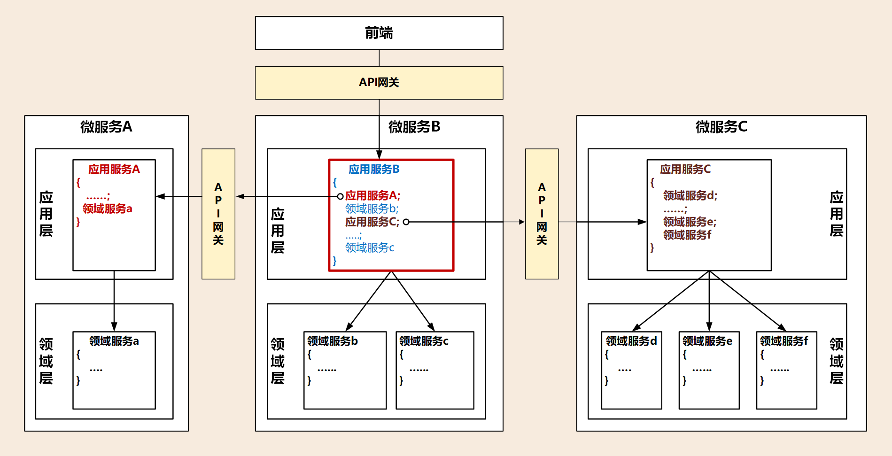
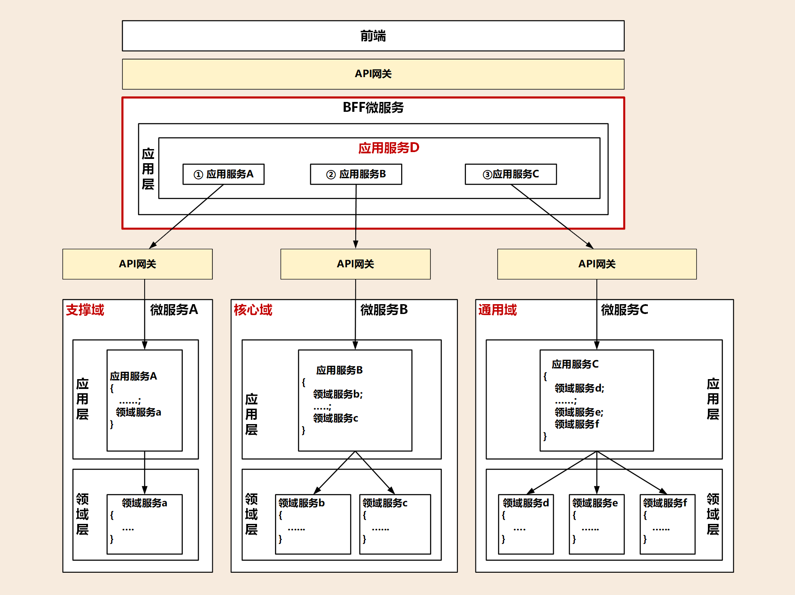

# 架构模型的对比和分析

> https://hanchenhao.github.io/MadBOK/DomainDrivenDesign/09-%E6%9E%B6%E6%9E%84%E6%A8%A1%E5%9E%8B.html#%E6%9E%B6%E6%9E%84%E6%A8%A1%E5%9E%8B%E7%9A%84%E5%AF%B9%E6%AF%94%E5%92%8C%E5%88%86%E6%9E%90

虽然 DDD 分层架构、整洁架构、六边形架构的架构模型表现形式不一样，这三种架构模型的设计思想正是微服务架构高内聚低耦合原则的体现，而它们身上正是以领域模型为中心的设计思想。

注图中的红色线框，它们是非常重要的分界线，这三种架构里面都有，它的作用就是将核心业务逻辑与外部应用、基础资源进行隔离。

红色框内部主要实现核心业务逻辑，但核心业务逻辑也是有差异的，有的业务逻辑属于领域模型的能力，有的则属于面向用户的用例和流程编排能力。按照这种功能的差异，我们在这三种架构中划分了应用层和领域层，来承担不同的业务逻辑。

领域层实现面向领域模型，实现领域模型的核心业务逻辑，属于原子模型，它需要保持领域模型和业务逻辑的稳定，对外提供稳定的细粒度的领域服务，所以它处于架构的核心位置。

应用层实现面向用户操作相关的用例和流程，对外提供粗粒度的 API 服务。它就像一个齿轮一样进行前台应用和领域层的适配，接收前台需求，随时做出响应和调整，尽量避免将前台需求传导到领域层。应用层作为配速齿轮则位于前台应用和领域层之间。

这三种架构都考虑了前端需求的变与领域模型的不变。需求变幻无穷，但变化总是有矩可循的，用户体验、操作习惯、市场环境以及管理流程的变化，往往会导致界面逻辑和流程的多变。但总体来说，不管前端如何变化，在企业没有大的变革的情况下，核心领域逻辑基本不会大变，所以领域模型相对稳定，而用例和流程则会随着外部应用需求而随时调整。把握好这个规律，我们就知道该如何设计应用层和领域层了。

架构模型通过分层的方式来控制需求变化从外到里对系统的影响，从外向里受需求影响逐步减小。面向用户的前端可以快速响应外部需求进行调整和发布，灵活多变，应用层通过服务组合和编排来实现业务流程的快速适配上线，减少传导到领域层的需求，使领域层保持长期稳定。这样可以保证领域层的核心业务逻辑不会因为外部需求和流程的变动而调整，对于建立前台灵活、中台稳固的架构很有帮助。

# 合理的架构分层

微服务设计要有分层的设计思想，让各层各司其职，建立松耦合的层间关系。

不要把与领域无关的逻辑放在领域层实现，保证领域层的纯洁和领域逻辑的稳定，避免污染领域模型。也不要把领域模型的业务逻辑放在应用层，这样会导致应用层过于庞大，最终领域模型会失焦。如果实在无法避免，我们可以引入防腐层，进行新老系统的适配和转换，过渡期完成后，可以直接将防腐层代码抛弃。

有的微服务可以与前端应用集成，一起完成特定的业务，这是项目级微服务。而有的则是某个职责单一的中台微服务，企业级的业务流程需要将多个这样的微服务组合起来才能完成，这是企业级中台微服务。两类微服务由于复杂度不一样，集成方式也会有差异。

# 项目级微服务
项目级微服务的内部遵循分层架构模型就可以了。领域模型的核心逻辑在领域层实现，服务的组合和编排在应用层实现，通过 API 网关为前台应用提供服务，实现前后端分离。但项目级的微服务可能会调用其它微服务，比如某个项目级微服务 B 调用认证微服务 A，完成登录和权限认证。

通常项目级微服务之间的集成，发生在微服务的应用层，由应用服务调用其它微服务发布在 API 网关上的应用服务。下图中微服务 B 中红色框内的应用服务 B，它除了可以组合和编排自己的领域服务外，还可以组合和编排外部微服务的应用服务。它只要将编排后的服务发布到 API 网关供前端调用，这样前端就可以直接访问自己的微服务了。

# 企业级微服务
企业级微服务的集成不能像项目级微服务一样，在某一个微服务内完成跨微服务的服务组合和编排。

我们可以在中台微服务之上增加一层，你看下面这张图，增加的这一层就位于红色框内，它的主要职能就是处理跨中台微服务的服务组合和编排，以及微服务之间的协调，它还可以完成前端不同渠道应用的适配。如果再将它的业务范围扩大一些，我可以将它做成一个面向不同行业和渠道的服务平台。

我们可以借用 BFF（服务于前端的后端，Backend for Frontends），或暂且称它为 BFF 微服务。BFF 微服务与其它微服务存在较大的差异，就是它没有领域模型，因此这个微服务内也不会有领域层。BFF 微服务可以承担应用层和用户接口层的主要职能，完成各个中台微服务的服务组合和编排，可以适配不同前端和渠道的要求。

# 应用和资源的解耦与适配

传统以数据为中心的设计模式，应用会对数据库、缓存、文件系统等基础资源产生严重依赖。正是由于它们之间的这种强依赖的关系，我们一旦更换基础资源就会对应用产生很大的影响，因此需要为应用和资源解耦。

在微服务架构中，应用层、领域层和基础层解耦是通过仓储模式，采用依赖倒置的设计方法来实现的。在应用设计中，我们会同步考虑和基础资源的代码适配，那么一旦基础设施资源出现变更（比如换数据库），就可以屏蔽资源变更对业务代码的影响，切断业务逻辑对基础资源的依赖，最终降低资源变更对应用的影响。