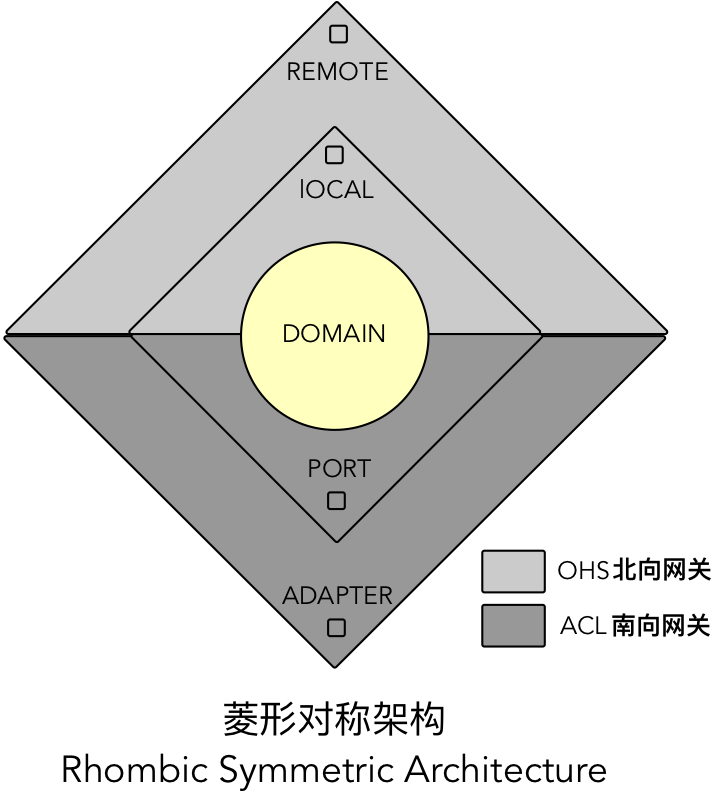

# 菱形对称架构

菱形对称架构（Diamond Symmetry Architecture）模式脱胎于六边形架构与分层架构，它以领域为核心对限界上下文的关注点进行划分，建立了由内部领域模型与外部网关组成的内外分层架构，以菱形的对称结构清晰展现了限界上下文的内部结构，指导着限界上下文的协作关系。引入菱形对称架构有助于促进团队对限界上下文与上下文映射的一致理解，并促成团队形成统一的代码模型。

