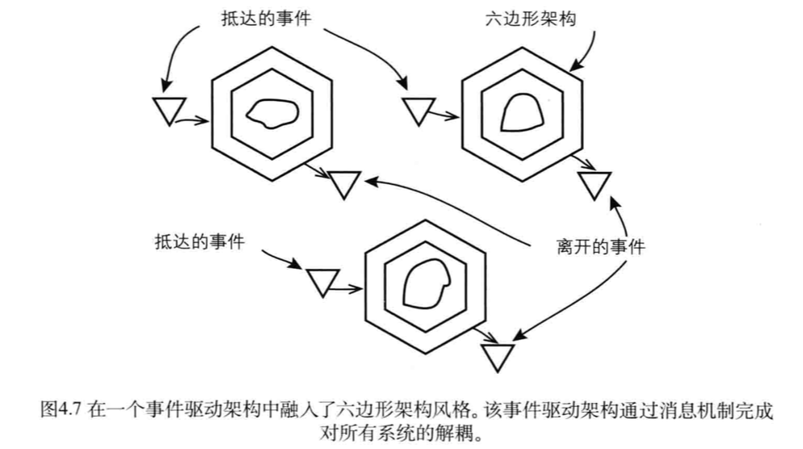

# 事件驱动架构(EDA, event-driven architecture)

是一种用于处理事件的生成、发现和处理等任务的软件架构。下图用户阐述如何将事件驱动架构用于多个六边形架构系统。(当然完全可以把六边形架构替换为分层架构或者其他架构)

是一种用于处理事件的生成、发现和处理等任务的软件架构。下图用户阐述如何将事件驱动架构用于多个六边形架构系统。(当然完全可以把六边形架构替换为分层架构或者其他架构)

一个系统的输出端口所发出的领域事件将被发送到另一个系统的输入端口，此后输入端口的事件订阅方将对事件进行处理。

