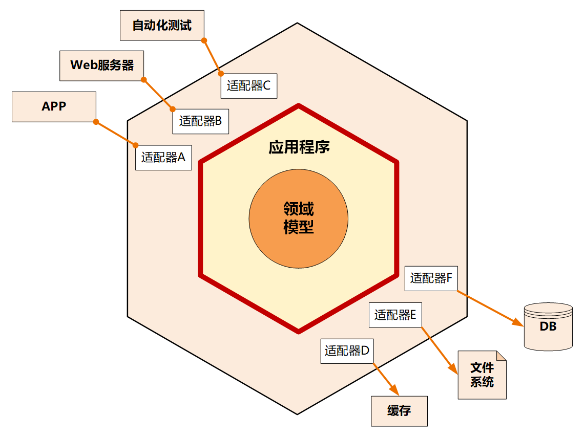

# 六边形架构

> https://hanchenhao.github.io/MadBOK/DomainDrivenDesign/09-%E6%9E%B6%E6%9E%84%E6%A8%A1%E5%9E%8B.html#%E5%85%AD%E8%BE%B9%E5%BD%A2%E6%9E%B6%E6%9E%84

六边形架构又名“端口适配器架构”。追溯微服务架构的渊源，一般都会涉及到六边形架构。

六边形架构的核心理念是：应用是通过端口与外部进行交互的。这也是微服务架构下 API 网关盛行的主要原因。

在六边形架构中，红圈内的核心业务逻辑（应用程序和领域模型）与外部资源（包括 APP、Web 应用以及数据库资源等）完全隔离，仅通过适配器进行交互。它解决了业务逻辑与用户界面的代码交错问题，很好地实现了前后端分离。六边形架构各层的依赖关系与整洁架构一样，都是由外向内依赖。

六边形架构将系统分为内六边形和外六边形两层，这两层的职能划分如下：

- 红圈内的六边形实现应用的核心业务逻辑；
- 外六边形完成外部应用、驱动和基础资源等的交互和访问，对前端应用以 API 主动适配的方式提供服务，对基础资源以依赖倒置被动适配的方式实现资源访问。
- 六边形架构的一个端口可能对应多个外部系统，不同的外部系统也可能会使用不同的适配器，由适配器负责协议转换。这就使得应用程序能够以一致的方式被用户、程序、自动化测试和批处理脚本使用。