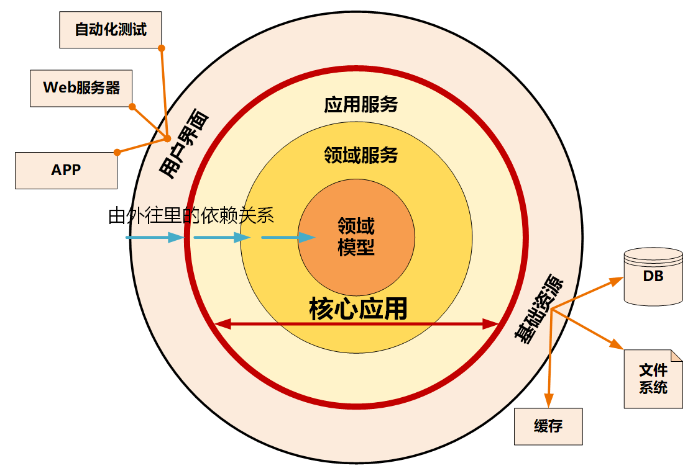

# 整洁架构
> https://hanchenhao.github.io/MadBOK/DomainDrivenDesign/09-%E6%9E%B6%E6%9E%84%E6%A8%A1%E5%9E%8B.html#%E6%95%B4%E6%B4%81%E6%9E%B6%E6%9E%84

整洁架构又名“洋葱架构”。整洁架构的层就像洋葱片一样，它体现了分层的设计思想。在整洁架构里，同心圆代表应用软件的不同部分，从里到外依次是领域模型、领域服务、应用服务和最外围的容易变化的内容，比如用户界面和基础设施。

整洁架构最主要的原则是依赖原则，它定义了各层的依赖关系，**越往里依赖越低，代码级别越高，越是核心能力。**外圆代码依赖只能指向内圆，内圆不需要知道外圆的任何情况。

在洋葱架构中，各层的职能是这样划分的：

- 领域模型实现领域内核心业务逻辑，它封装了企业级的业务规则。领域模型的主体是实体，一个实体可以是一个带方法的对象，也可以是一个数据结构和方法集合。
- 领域服务实现涉及多个实体的复杂业务逻辑。
- 应用服务实现与用户操作相关的服务组合与编排，它包含了应用特有的业务流程规则，封装和实现了系统所有用例。
- 最外层主要提供适配的能力，适配能力分为主动适配和被动适配。主动适配主要实现外部用户、网页、批处理和自动化测试等对内层业务逻辑访问适配。被动适配主要是实现核心业务逻辑对基础资源访问的适配，比如数据库、缓存、文件系统和消息中间件等。
- 红圈内的领域模型、领域服务和应用服务一起组成软件核心业务能力。

